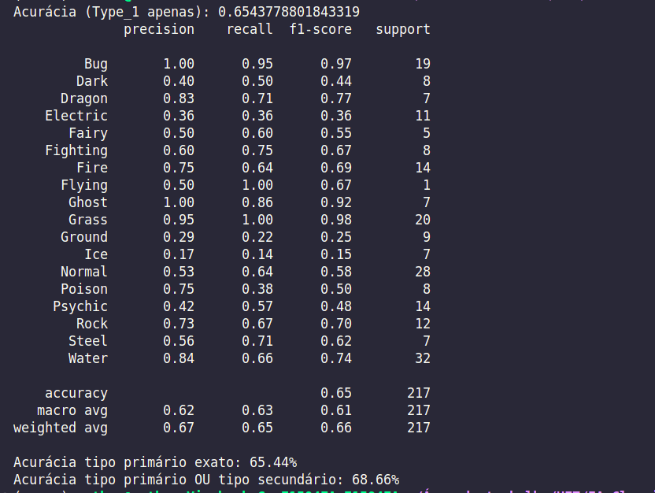
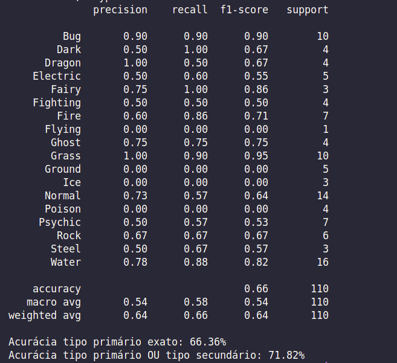
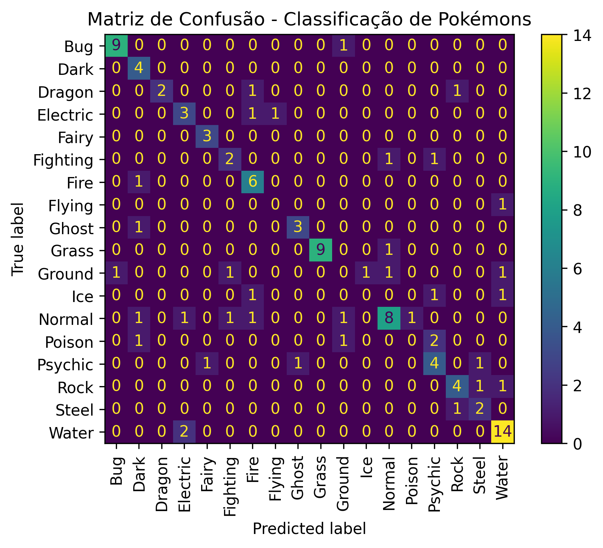

# IA-Classificacao-Pokemons

O objetivo desta atividade foi criar uma rede neural MLP capaz de resolver um problema de classificação definido, particularmente o de adivinhar o tipo de um dado pokemon a partir de alguns parâmetros coletados de uma base de dados. Caso o pokemon possua dois tipos, e pelo menos um tipo foi previsto com sucesso, considera-se como um todo sucesso a previsão.

<h2>Ambiente</h2>

Foram usadas as bibliotecas do python <code>scikit-learn</code>, para criar a rede e tratar o conjunto de dados, <code>pandas</code>, para leitura do CSV e normatização, <code>matplotlib</code>, para criar o gráfico da matriz de confusão, e <code>joblib</code>, para salvar em arquivo o conjunto de dados normatizado e a rede MLP.

A base de dados utilizada no algoritmo está disponível <a href="https://www.kaggle.com/datasets/alopez247/pokemon/code">neste link</a>, e foi baixada como CSV.

O código foi escrito no VSCode, e tudo foi executado no sistema operacional Linux. A versão do python utilizada é a <code>3.12.3</code>.

<h2>Primeiro teste</h2>

Inicialmente, os parâmetros foram:

```python
modelo = MLPClassifier(
    hidden_layer_sizes=(128, 64),  
    activation='relu',             
    solver='adam',                
    max_iter=500,                
    random_state=42
)
```

Nesse molde, os resultados não foram satisfatórios, estão dispostos na imagem abaixo. Foram utilizadas as métricas de avaliação <i>precision, recall</i> e <i>f1-score</i>, contudo, para contabilizar sucessos no acerto de pelo menos um dos tipos (ambos serviriam como rótulos), foi criado um método diferente para cálculo da acurácia.



A acurácia do primeiro tipo foi de 65.44%, enquanto que considerando ambos tipos foi 68.66%. O objetivo é obter uma acurácia de 70% para cima, de modo a considerar a rede satisfatória.

<h2>Ajustes</h2>

Eventualmente, foi percebido o maior problema da rede: as classes estavam desbalanceadas, de modo que, a exemplo, o tipo voador "Flying", possuía somente dois registros, sendo ambos da mesma família Pokemon. Isso se deu pela característica dos jogos de Pokemon priorizarem o tipo voador como tipo secundário, o que fez com que o número de Pokemon dessa classe e outras caíssem tanto de modo que o algoritmo SMOTE também não foi capaz de suprir, pois criar dados sintéticos a partir de duas instâncias não gerou resultados desejáveis. Deste modo, foi necessária uma intervenção manual no conjunto de dados, tendo adicionado mais seis registros para o tipo voador, com informações oficiais precisas buscadas no <a href="https://bulbapedia.bulbagarden.net/wiki/Rookidee_(Pok%C3%A9mon)">Bulbapedia</a>. Deste modo, o SMOTE teria maior capacidade para criar registros sintéticos e, assim, balancear as classes.

Esta mudança, somada a todas as outras, permitiu eventualmente uma melhora na acurácia total. Segue a lista de mudanças que obtiveram o teste de melhor sucesso:
<ul>
    <li>Vários parâmetros foram removidos na preparação dos dados pois impactam de forma alguma no tipo do Pokemon. Os parâmetros removidos foram <code>Number, Pr_Male, Generation, hasGender, hasMegaEvolution, isLegendary, Catch_Rate</code> e <code>Name</code></li>
    <li>Diminuída a base usada para testes para 10% da base total</li>
    <li>Substituído o <code>StandardScaler</code> por <code>RobustScaler</code>, que lida melhor com dados muito discrepantes (por exemplo, o peso varia bastante entre os pokemons)</li>
    <li>Adicionada uma verificação para evitar normalizar dados binários transformados. Essa função foi necessária pois alguns campos, como Egg_Group, possuem dados textuais, que não poderiam ser processados do mesmo modo, e foram convertidos para valores binários correspondentes. Portanto, para evitar que o normalizador altere a informação desses dados, foram retirados dessa parte</li>
    <li>Adicionado balanceador de classes via SMOTE, que cria registros sintéticos baseados nos registros reais da base de dados (somente nos conjuntos de treinamento)</li>
    <li>Algumas mudanças na rede MLP:</li>
        <ul>
        <li><code>hidden_layer_sizes</code> foi aumentado para cinco camadas ocultas, de valores 2048, 1024, 512, 256 e 128</li>
        <li><code>batch_size</code> foi explicitamente declarado como 32 (antes era o padrão 256)</li>
        <li><code>max_iter</code> foi aumentado para 2000 iterações</li>
        </ul>
</ul>

<h2>Melhor resultado</h2>

Com os ajustes feitos, o melhor resultado foi o disposto na seguinte figura



Os ajustes permitiram uma precisão de pelo menos um dos tipos de 71.82%, o que era o objetivo desejável, contudo há algumas observações. Como disposto na matriz de confusão, criada com <code>matplotlib</code>



É de se notar que, com pelo menos quatro tipos, o algoritmo não foi capaz de prever nenhum registro dos conjuntos de teste. Isso pode se dar pela falta de registros, de como que acabaram não sendo suficientes para montar uma rede confiável. A base de dados possui uma eficácia consistente para, por exemplo, os tipos água e inseto, que possuem vários registros e características mais marcantes em membros do seu tipo

Também, a presença de vários pokemons lendários afeta a rede, pois de certo modo são <i>outliars</i>, dado que geralmente possuem status mais elevados que pokemons comuns, o que pode confundir a rede

A rede utilizou cinco camadas ocultas, tornando-a lenta, mas foi o padrão que mais trouxe resultados. Possivelmente uma oportunidade de otimização seria diminuir o números de camadas ocultas sem perturbar a eficácia

<h2>Conclusão</h2>

Com os dados dispostos, o algoritmo teve uma eficácia de ao menos um dos tipos próxima de 72%. O resultado é satisfatório, pois, mesmo que compartilhem o tipo, pokemons são diferentes entre si e não necessariamente saber seu tipo corporal ou cor é o suficiente para categorizá-lo. Possivelmente, a melhor oportunidade de otimização e melhora do algoritmo seria utilizar ambos tipos para categorização do pokemon, criando uma rede <code>multilabel</code>, assim contornando o problema de falta de regsitros e como um todo melhorando a eficácia
